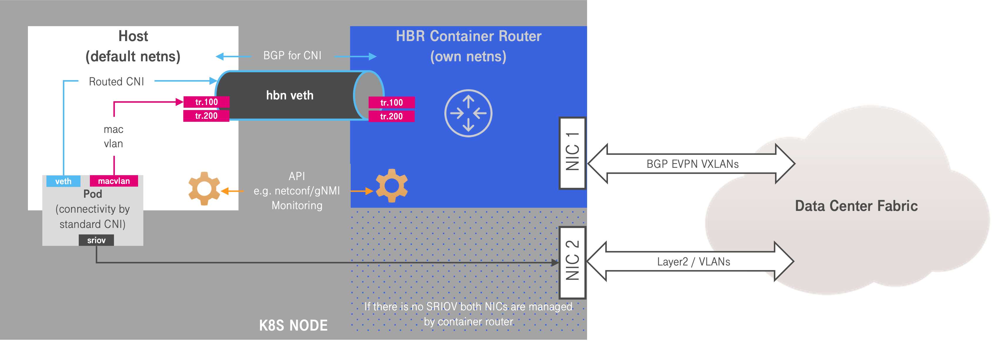

# network-operator
<p align='center'>
    
</p>

With our BGP-EVPN to the host architecture, `network-operator` is responsible for the configuration and monitoring of the host router according to the specified declarative state.

The project provides five components:
- One central `operator`, taking in desired state and deriving config revisions out of it. Further it controls the gradual rollout of the revisions.
  This is achieved by generating the `NodeNetworkConfig` and `NodeNetplanConfig` resources for each node, waiting for them to be provisioned successfully and then choosing the next node.
- A set of "agents" running as DaemonSets:
  - `agent-cra-frr`: Reading the `NodeNetworkConfig` for the respective node it is running on.
    It is responsible for configuring the so called _Containerized Routing Agent_ (CRA) of FRR.
  - `agent-netplan`: Taking the `NodeNetplanConfig` and applying it to the host network namespace.
  - `agent-hbn-l2`: This is an alternative to `agent-netplan`, providing a very simple binary to apply the needed configuration, a subset of the `netplan` functionality and spec.
- The _containerized routing agent_ (CRA), providing FRR and a small `cra-frr` configuration binary. This exposes an API to dynamically configure L2 and L3VNIs and reconfigure FRR.



## Deploying the operator
There are two possibilities to deploy the operator:
1. Run everything through Kubernetes, providing BGP-EVPN services to an existing cluster
2. Start `cra-frr` as a standalone container during provisioning and deploy the other components later with Kubernetes.

```
WIP
```

## License

This project is licensed under Apache License Version 2.0, with the **exception of the code in [`./bpf/](./bpf/)** which falls under the [GPLv2 license](./bpf/LICENSE).

Copyright (c) 2022 Deutsche Telekom AG.

Licensed under the Apache License, Version 2.0 (the "License"); you may not use this file except in compliance with the License.

You may obtain a copy of the License at https://www.apache.org/licenses/LICENSE-2.0.

Unless required by applicable law or agreed to in writing, software distributed under the License is distributed on an "AS IS" BASIS, WITHOUT WARRANTIES OR CONDITIONS OF ANY KIND, either express or implied. See the LICENSE for the specific language governing permissions and limitations under the License.
