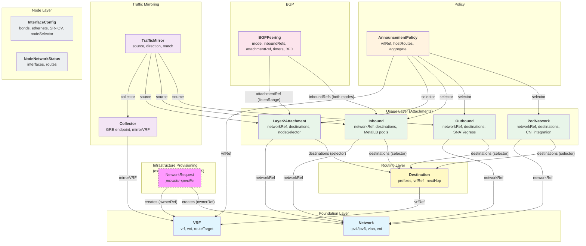
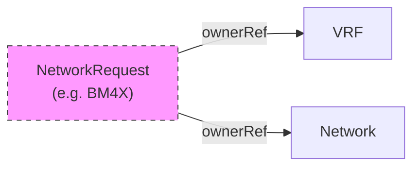
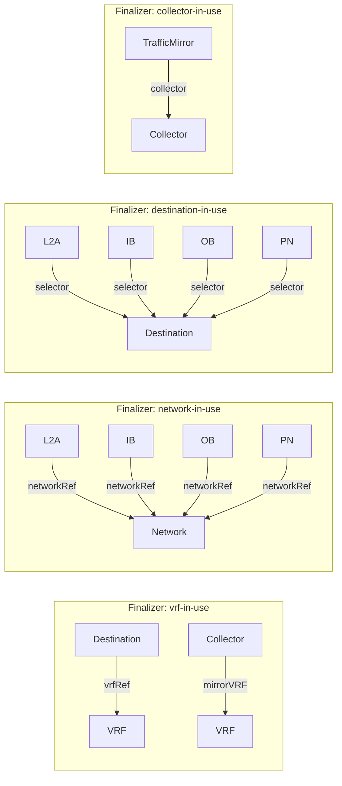
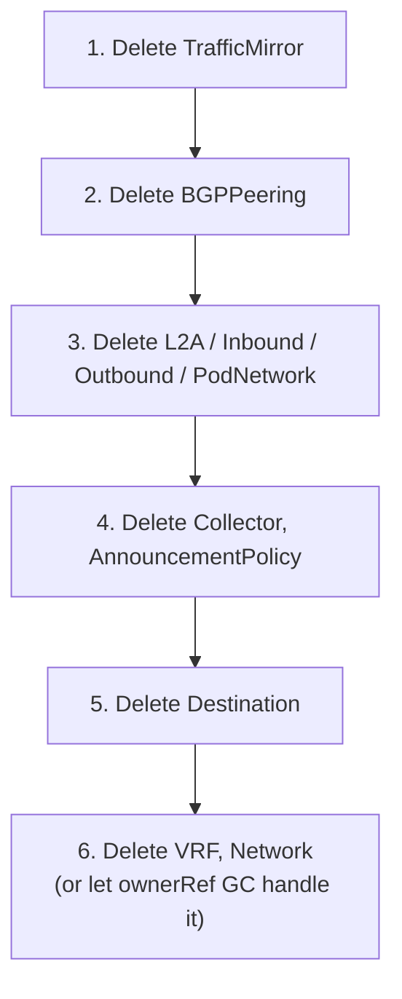
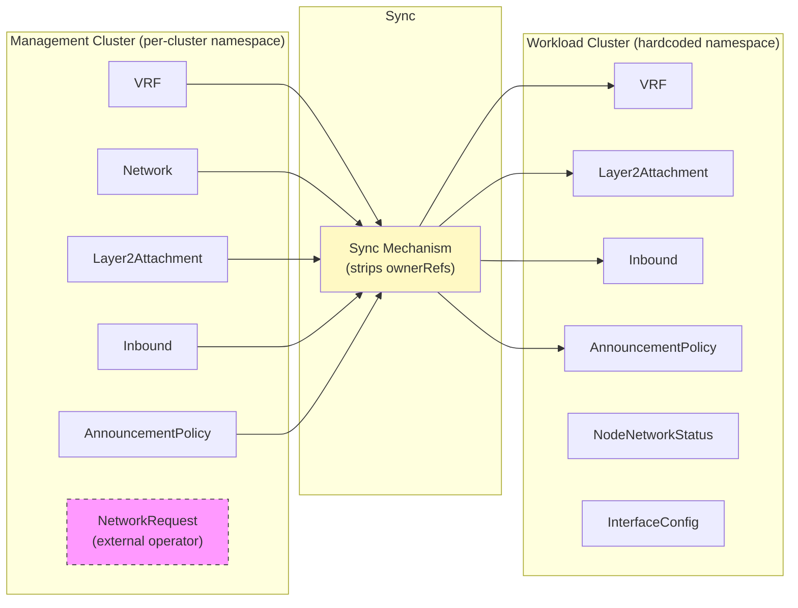

# Network Connector CRDs

API group: `network-connector.sylvaproject.org/v1alpha1`

This package defines 13 intent-based CRDs for declarative network configuration
across management and workload clusters.

## CRD Overview

| CRD | Short Name | Purpose |
|-----|-----------|---------|
| **VRF** | `ncvrf` | Backbone VRF identity — name, VNI, route target |
| **Network** | `ncnet` | IP address pool — CIDR, VLAN, VNI |
| **Destination** | `dst` | Routing target — prefixes via VRF or static next-hop |
| **Layer2Attachment** | `l2a` | Attach a Network as L2 segment to nodes |
| **Inbound** | `ib` | Allocate IPs for MetalLB pools (ingress LBs) |
| **Outbound** | `ob` | Allocate IPs for SNAT / Coil egress |
| **PodNetwork** | `pnet` | Additional pod-level networks from a Network |
| **BGPPeering** | `bgpp` | BGP session — listenRange (L2) or loopbackPeer (BGPaaS); always references Inbound pools |
| **Collector** | `col` | GRE collector endpoint + mirror VRF binding |
| **TrafficMirror** | `tmir` | Mirror traffic from an attachment to a Collector |
| **InterfaceConfig** | `ifc` | Node-level interface provisioning (bonds, NICs) |
| **NodeNetworkStatus** | `nns` | Per-node network inventory (agent-populated) |
| **AnnouncementPolicy** | `ap` | Route export steering — host/aggregate communities + aggregate sizing |

## How Networks Get Created

This operator does **not** provision infrastructure. VRF and Network resources are the
**universal contract boundary** — any infrastructure provisioner (BM4X, Netbox, manual)
creates them, and this operator handles everything downstream.

**Recommended pattern with BM4X:**

```
Git repo (SI engineer writes):
├── networkrequest-prod-lb.yaml     # bm4x.t-caas.../NetworkRequest "prod-lb"
│                                    #   configurationType, harmonization, project...
├── inbound-prod.yaml               # networkRef: prod-lb  ← same name
└── bgppeering-prod.yaml            # refs inbound-prod
```

The BM4X operator processes the `NetworkRequest`, calls the BM4X API, and creates a
`network-connector.sylvaproject.org/Network` with the **same name**. Usage CRDs reference
the name the SI engineer chose — normal K8s reconciliation retries until the Network exists.

All BM4X-specific fields (configurationType, harmonization, project, bgpOverSriov) stay
encapsulated in the BM4X operator and never leak into this API group.

## Resource Dependency Graph



### nodeSelector

Only CRDs with physical node-level concerns carry `nodeSelector`:

| CRD | nodeSelector | Reason |
|-----|:---:|--------|
| **Layer2Attachment** | ✅ | L2 segment must be placed on specific nodes |
| **InterfaceConfig** | ✅ | Physical interface config targets specific nodes |
| Inbound, Outbound, PodNetwork | ❌ | Node scoping inherited from Destination/VRF; pod placement is the scheduler's job |

## Ownership & Finalizer Structure

### OwnerRef Relationships (cascading GC)

Only the external infrastructure provisioning operator sets ownerRefs:



- Multiple provisioning CRDs can co-own a shared VRF via multiple ownerRefs
- K8s GC deletes the VRF only when **all** owners are removed
- VRF + Network can also be created manually (no ownerRef needed)

### Finalizer Protection (prevents premature deletion)

Finalizers prevent deletion of resources that are still referenced:



| Finalizer | Set On | Set By | Prevents |
|-----------|--------|--------|----------|
| `vrf-in-use` | VRF | Destination, Collector controllers | VRF deletion while referenced |
| `network-in-use` | Network | L2A/IB/OB/PN controllers | Network deletion while referenced |
| `destination-in-use` | Destination | L2A/IB/OB/PN controllers | Destination deletion while selected |
| `collector-in-use` | Collector | TrafficMirror controller | Collector deletion while mirrored |
| `cleanup` | Usage CRDs | Own controller | Deletion before platform resources cleaned up |

### Required Deletion Order

Finalizers enforce this ordering — resources stuck in `Terminating` indicate
out-of-order deletion:



## Cross-Cluster Architecture



- **Management cluster**: All CRDs live in a per-cluster namespace (e.g., `cluster-a`)
  - OwnerRefs work natively (same namespace)
  - SI engineers create/manage resources here
- **Workload cluster**: CRDs synced into a hardcoded namespace (e.g., `schiff-network`)
  - OwnerRefs are stripped (management-cluster UIDs don't exist here)
  - Lifecycle managed by sync mechanism, not K8s GC
  - `NodeNetworkStatus` and `InterfaceConfig` are workload-cluster-only

## Condition Types

| Condition | Used By | Meaning |
|-----------|---------|---------|
| `Ready` | All CRDs | Successfully reconciled end-to-end |
| `Resolved` | Usage CRDs | All references (networkRef, vrfRef) resolved |
| `Applied` | Usage CRDs, InterfaceConfig | Configuration applied to target nodes |
| `InterfaceNotFound` | Layer2Attachment | Referenced interface missing on node |
| `DuplicateVRF` | VRF | Another VRF in same namespace has same `spec.vrf` |

## Key Status Fields

### BGPPeering Status (controller-resolved, not user-configured)

| Field | Source | Meaning |
|-------|--------|---------|
| `asNumber` | Platform config | Platform-side autonomous system number |
| `neighborASNumber` | Platform config | Remote peer ASN (e.g., site/fabric ASN) |
| `neighborIPs` | Auto-derived per mode | listenRange: from L2A transfer network; loopbackPeer: ULA IPv6; SR-IOV VTEP_NODE: route reflector IPs |
| `workloadASNumber` | Spec or auto-generated | Workload-side ASN (echoed from spec or deterministically generated) |

### Layer2Attachment Key Spec Fields

| Field | Purpose |
|-------|---------|
| `disableAnycast` | Disables anycast gateway |
| `disableNeighborSuppression` | Disables ARP suppression in VXLAN |
| `disableSegmentation` | Disables TX/RX segmentation offload on the interface |
| `sriov.enabled` | Enables SR-IOV (immutable) |
| `mtu` | Interface MTU (1000–9000) |
| `nodeIPs.enabled` | Assigns node IPs from the network |

## Quick Start Example

A minimal HBN setup with an L2 attachment and ingress LB pool:

```yaml
# 1. Foundation: VRF + Network (created by infra provisioning or manually)
apiVersion: network-connector.sylvaproject.org/v1alpha1
kind: VRF
metadata:
  name: prod
spec:
  vrf: PROD
  vni: 100
  routeTarget: "65000:100"
---
apiVersion: network-connector.sylvaproject.org/v1alpha1
kind: Network
metadata:
  name: prod-lb
spec:
  ipv4:
    cidr: "198.51.100.0/24"
    prefixLength: 28
  vlan: 100
---
# 2. Routing: Destination defines reachable prefixes via VRF
apiVersion: network-connector.sylvaproject.org/v1alpha1
kind: Destination
metadata:
  name: corp-dc
  labels:
    env: prod
spec:
  vrfRef: prod
  prefixes:
    - "10.0.0.0/8"
    - "172.16.0.0/12"
---
# 3. Usage: Inbound allocates LB IPs from Network, exports into VRF
apiVersion: network-connector.sylvaproject.org/v1alpha1
kind: Inbound
metadata:
  name: prod-ingress
spec:
  networkRef: prod-lb
  destinations:
    matchLabels:
      env: prod
  count: 4
  advertisement:
    type: bgp
---
# 4. Policy: Attach communities to host-route exports
apiVersion: network-connector.sylvaproject.org/v1alpha1
kind: AnnouncementPolicy
metadata:
  name: prod-communities
spec:
  vrfRef: prod
  hostRoutes:
    communities:
      - "65000:1000"
  aggregate:
    communities:
      - "65000:2000"
```
