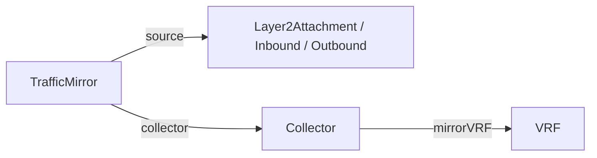

# Traffic Mirroring Design

The intent-based traffic mirroring feature (`Collector` + `TrafficMirror` in the
`network-connector.sylvaproject.org` group) lets you mirror traffic from an
attachment to a remote GRE collector declaratively. This page summarizes the
design; see the [Traffic Mirroring guide](../guides/traffic-mirroring.md) for
usage.

!!! info "Full design proposal"
    The authoritative design is maintained in the repository at
    [`docs/proposals/01-traffic-mirroring/`](https://github.com/telekom/das-schiff-network-operator/tree/main/docs/proposals/01-traffic-mirroring).

## Model

Two resources separate the *where to* from the *what*:

- **`Collector`** — the remote GRE endpoint and its mirror VRF binding. It owns
  the GRE encapsulation type (`l3gre` / `l2gre`, immutable), the tunnel key, and
  a per-node loopback source-address pool allocated from `mirrorVRF.loopback.subnet`.
  One Collector can be shared by many mirrors (`status.referenceCount`).
- **`TrafficMirror`** — binds a source attachment (`Layer2Attachment`, `Inbound`
  or `Outbound`) to a Collector, with a `direction` and an optional
  `trafficMatch` filter.

## Design properties

- **Per-node source IPs**: the Collector allocates a stable loopback address per
  in-scope node from the configured subnet, persisted in
  `status.nodeAddresses` and reported via the `AddressesAllocated` condition.
- **Reference safety**: a `collector-in-use` finalizer prevents deleting a
  Collector while any TrafficMirror references it.
- **Compiles to `MirrorACL`**: mirrors are rendered into the per-node
  `NodeNetworkConfig` (see [Debugging](../advanced/debugging.md)).

## Relationship to the legacy mechanism

This supersedes the legacy `MirrorTarget` / `MirrorSelector` resources in the
`network.t-caas.telekom.com` group — see
[Legacy API](../advanced/legacy-api.md).

## Related

- [Traffic Mirroring guide](../guides/traffic-mirroring.md)
- [CRD Reference](../reference/crd-reference.md#collector)
