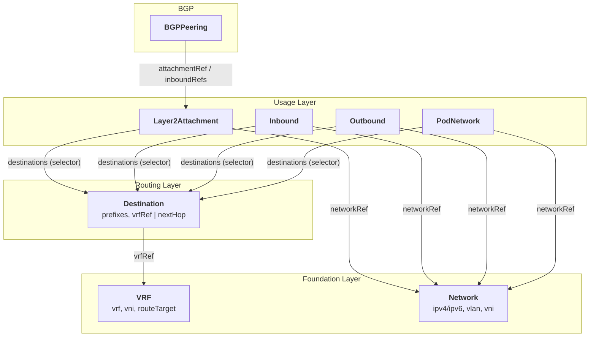
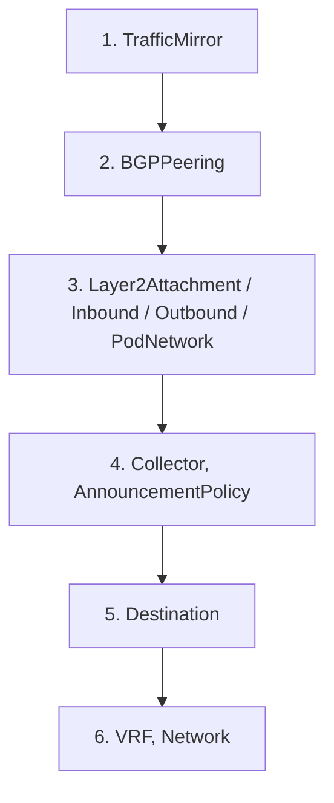

# Concepts

This page explains the vocabulary and the model the rest of the documentation
builds on. Read it once; the [guides](../guides/inbound.md) then become
straightforward.

## Intent-based configuration

You never configure FRR, netlink, VXLAN or MetalLB directly. Instead you declare
**intent** as Kubernetes custom resources in the API group
`network-connector.sylvaproject.org/v1alpha1`. The operator:

1. **Resolves** the references between your resources (`networkRef`, `vrfRef`,
   label selectors).
2. **Derives** the concrete per-node configuration.
3. **Rolls it out** node by node as `NodeNetworkConfig` and `NodeNetplanConfig`
   resources, which the node agents apply.

This means your Git repository contains only the high-level intent; everything
below it is generated and reconciled.

## The resource layers

The custom resources fall into four layers. You typically only *author* the
routing and usage layers — the foundation is often created by an infrastructure
provisioner.



### Foundation: `VRF` and `Network`

- A **`VRF`** is a backbone routing domain identity — a name, a VXLAN Network
  Identifier (`vni`) and a BGP `routeTarget`. VRFs are shared across many
  Destinations and attachments.
- A **`Network`** is an IP address pool — one or both of an `ipv4`/`ipv6` CIDR,
  plus an optional `vlan` and `vni`. Everything in the usage layer allocates
  from a Network via `networkRef`.

!!! info "Who creates VRF and Network?"
    This operator does **not** provision infrastructure. `VRF` and `Network` are
    the *contract boundary*: any provisioner (BM4X, Netbox, or a human) creates
    them, and the operator handles everything downstream. You can also create
    them by hand — see the [Quick Start](quick-start.md).

### Routing: `Destination`

A **`Destination`** names a set of reachable `prefixes` and binds them either to
a `vrfRef` (a VRF backbone) or a static `nextHop`. Destinations carry labels;
usage resources select them with a `destinations` label selector rather than
referencing them by name. This lets one Destination serve many attachments and
keeps intent loosely coupled.

### Usage: what you actually write

| Resource | Purpose | Guide |
|---|---|---|
| `Layer2Attachment` | Attach a Network to nodes as an L2 segment | [L2A](../guides/layer2-attachment.md) |
| `Inbound` | Allocate ingress LoadBalancer IPs (MetalLB) | [Inbound](../guides/inbound.md) |
| `Outbound` | Allocate egress / SNAT IPs (Coil / Calico) | [Outbound](../guides/outbound.md) |
| `PodNetwork` | Additional pod-level networks for CNI | [PodNetwork](../guides/pod-network.md) |
| `BGPPeering` | BGP session with L2 clients or tenant workloads | [BGPPeering](../guides/bgp-peering.md) |
| `Collector` + `TrafficMirror` | Mirror traffic to a GRE collector | [Traffic Mirroring](../guides/traffic-mirroring.md) |

## Deployment modes: HBN vs. non-HBN (pure L2 / netplan)

The same intent CRDs support two data-plane modes. Which one you get is decided
by *field presence*, not a separate resource — there is no mode switch and the
admission webhook does not force either one.

| | **HBN mode** | **non-HBN mode** (pure L2 / netplan) |
|---|---|---|
| Full name | Host-Based Networking | Physical interface / VLAN sub-interface / MetalLB-only |
| Data plane | **VXLAN tunnel + VRF** overlay, BGP-EVPN on the host | **Plain VLAN sub-interface** on a physical NIC / bond |
| L2A trigger | `interfaceRef` **omitted** → VXLAN created automatically | `interfaceRef` **set** → VLAN sub-interface on that NIC/bond |
| `Network` `vni` | **required** | must **not** be set |
| Routing | VRF import via `Destination.vrfRef` | static routes via `Destination.nextHop`, or none |
| `destinations` omitted | no VRF plumbing (unusual) | typical → pure L2 bridge only |
| `Inbound` result | `/32` host exports into the VRF **+** MetalLB pool + advertisement | MetalLB pool + advertisement only |
| `Outbound` result | VRF host exports + egress NAT + Coil + Calico | Coil Egress + Calico only |

### HBN mode (VXLAN/VRF overlay)

The host runs BGP-EVPN. A `Layer2Attachment` with **no** `interfaceRef` creates a
VXLAN interface automatically, and `destinations` plumb the segment into one or
more VRFs. This is the default "BGP-EVPN to the host" model. The referenced
`Network` must carry a `vni`. The L3 overlay is programmed via `NodeNetworkConfig`
and applied by the **CRA agents** (`agent-cra-frr` / `agent-cra-vsr`).

### non-HBN mode (pure L2 / netplan)

No overlay. A `Layer2Attachment` with `interfaceRef` set creates a **VLAN
sub-interface** on the named physical NIC or bond — a plain L2 segment, commonly
used to hand VLANs to VMs (vSphere/OpenStack) or to run MetalLB without a VRF.
Omitting `destinations` means no VRF plumbing (bridge only). Host interfaces are
applied via `NodeNetplanConfig` by **`agent-netplan`** (full netplan) or its
lightweight alternative **`agent-hbn-l2`**.

For `Inbound` and `Outbound` there is no `interfaceRef` field — mode is decided
**solely** by whether `destinations` is set. With `destinations`, IPs are also
exported into the matched VRFs (HBN); without it, only the MetalLB pool /
Coil egress objects are created (non-HBN).

!!! warning "`agent-hbn-l2` is not the VXLAN engine"
    Despite the name, `agent-hbn-l2` only applies host VLANs/loopbacks (a subset
    of netplan) — it is an alternative to `agent-netplan`, consuming the same
    `NodeNetplanConfig`. The VXLAN/EVPN/VRF overlay is always programmed through
    `NodeNetworkConfig` by the CRA agents. The clean split is: **L3 overlay =
    `NodeNetworkConfig` → CRA agents**; **host L2 plumbing = `NodeNetplanConfig`
    → netplan/hbn-l2 agent** — in *both* modes.

See the [Layer2Attachment guide](../guides/layer2-attachment.md) for worked
examples of each mode.

## References and selectors

Two referencing styles are used consistently:

- **Direct name references** (`networkRef`, `vrfRef`, `attachmentRef`) point to a
  specific resource by `metadata.name` in the same namespace. Many are
  **immutable** — see the note below.
- **Label selectors** (`destinations`, `nodeSelector`) match a *set* of
  resources by label. `destinations` selects `Destination` CRDs; `nodeSelector`
  selects nodes.

!!! warning "Immutable fields"
    Fields such as `networkRef`, `spec.vrf`, `spec.mode` (BGPPeering) and
    `spec.sriov.enabled` (L2A) are immutable — the allocations and tunnels
    derived from them cannot be rebound in place. To change them, delete and
    recreate the resource. The [CRD Reference](../reference/crd-reference.md)
    marks every immutable field.

## `nodeSelector`

Only resources with physical node-level concerns carry a `nodeSelector`:

| Resource | `nodeSelector` | Why |
|---|:---:|---|
| `Layer2Attachment` | ✅ | An L2 segment must land on specific nodes |
| `InterfaceConfig` | ✅ | Physical interface config targets specific nodes |
| `Inbound`, `Outbound`, `PodNetwork` | ❌ | Node scope is inherited from the Destination/VRF; pod placement is the scheduler's job |

## Status and conditions

Every resource reports progress through its `status.conditions`. The common
condition types are:

| Condition | Meaning |
|---|---|
| `Ready` | Reconciled end-to-end |
| `Resolved` | All references (`networkRef`, `vrfRef`, …) resolved |
| `Applied` | Configuration applied to the target nodes |
| `InterfaceNotFound` | A referenced interface is missing on a node (L2A) |
| `DuplicateVRF` | Another VRF in the namespace declares the same `spec.vrf` |

Check readiness with:

```bash
kubectl get inbound my-ingress -o jsonpath='{.status.conditions}' | jq
```

## Lifecycle and deletion order

The operator protects referenced resources with **finalizers** so you cannot
delete a `Network` while an `Inbound` still uses it. As a result, deletion has a
required order — deleting bottom-up:



A resource stuck in `Terminating` almost always means something that references
it still exists. See [Debugging](../advanced/debugging.md).

## Management vs. workload clusters

In multi-cluster setups the intent resources are authored in a **management
cluster** (in a per-cluster namespace) and **synced** into a hardcoded namespace
in each **workload cluster**, where the node agents run. `NodeNetworkStatus` and
`InterfaceConfig` are workload-cluster-only. For a single-cluster deployment you
can ignore this distinction — everything lives in one namespace.

## Next steps

- [Install the operator](installation.md)
- [Run the Quick Start](quick-start.md)
- Jump into a [guide](../guides/inbound.md)
