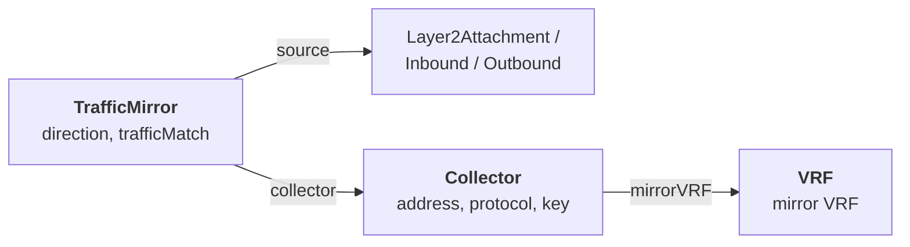

# Traffic Mirroring

Traffic mirroring copies packets seen on an attachment
([`Layer2Attachment`](layer2-attachment.md),
[`Inbound`](inbound.md) or [`Outbound`](outbound.md)) and sends a copy to a
remote **GRE collector** — a passive capture or IDS host. The mirrored traffic
is encapsulated in GRE and carried inside a dedicated **mirror VRF**, so it never
touches your production forwarding tables.

You declare intent with two custom resources in the
`network-connector.sylvaproject.org/v1alpha1` API group: a **`Collector`**
(the GRE endpoint and its mirror VRF) and a **`TrafficMirror`** (which attachment
to mirror, in which direction, optionally filtered). The operator derives the
per-node GRE interfaces, allocates source loopback addresses and rolls the
configuration out node by node.

!!! note "This supersedes the legacy mirroring API"
    This is the new intent-based mirroring in the
    `network-connector.sylvaproject.org` group. It **replaces** the legacy
    `MirrorTarget` / `MirrorSelector` CRDs in the
    `network.t-caas.telekom.com` group. For the older mechanism see
    [Legacy API](../advanced/legacy-api.md). Use `Collector` + `TrafficMirror`
    for all new configurations.

## How it works

Mirroring is split across two resources:

- **`Collector`** — defines the GRE tunnel endpoint (`address` + `protocol` +
  optional `key`) and binds it to a **mirror VRF**. It also owns a **loopback
  subnet** from which the controller allocates one **per-node GRE source
  address**. A single `Collector` can be shared by many `TrafficMirror`
  resources; its `status.referenceCount` tracks how many refer to it.
- **`TrafficMirror`** — binds one source attachment to a `Collector`, sets the
  `direction` (`ingress`, `egress` or `both`) and optionally narrows the copied
  traffic with a `trafficMatch` filter.



## Prerequisites

Before you can mirror traffic you need:

- A **mirror `VRF`** dedicated to carrying the encapsulated mirror traffic,
  referenced by the Collector's `spec.mirrorVRF.name`.
- A **mirrorable source** — a `Layer2Attachment`, `Inbound` or `Outbound` that
  already exists and is `Ready`.
- A **loopback subnet** (a CIDR under `spec.mirrorVRF.loopback.subnet`) large
  enough to give **one host address to every in-scope node**. An IPv4 `/29`
  yields 6 usable hosts.

The example below builds the full foundation — a mirror `VRF`, a `Destination`,
a `Network`, a `Layer2Attachment` and the `Collector`. See
[Concepts](../getting-started/concepts.md) for the model and the
[Quick Start](../getting-started/quick-start.md) for creating foundation
resources by hand.

```yaml
apiVersion: network-connector.sylvaproject.org/v1alpha1
kind: VRF
metadata:
  name: vrf-mirror
  namespace: default
spec:
  vrf: "mirror"
  vni: 2002099
  routeTarget: "65188:2099"
---
apiVersion: network-connector.sylvaproject.org/v1alpha1
kind: Destination
metadata:
  name: dest-mirror
  namespace: default
  labels:
    type: mirror
spec:
  vrfRef: "vrf-mirror"
  prefixes:
    - "10.250.90.0/24"
---
apiVersion: network-connector.sylvaproject.org/v1alpha1
kind: Network
metadata:
  name: net-mirror-vlan590
  namespace: default
spec:
  vlan: 590
  vni: 4000090
  ipv4:
    cidr: "10.250.90.0/24"
---
apiVersion: network-connector.sylvaproject.org/v1alpha1
kind: Layer2Attachment
metadata:
  name: l2a-mirror-vlan590
  namespace: default
spec:
  networkRef: "net-mirror-vlan590"
  destinations:
    matchLabels:
      type: mirror
```

## Step 1 — define the Collector

The `Collector` describes the remote GRE endpoint and the mirror VRF that
carries the encapsulated traffic:

```yaml
apiVersion: network-connector.sylvaproject.org/v1alpha1
kind: Collector
metadata:
  name: col-mirror
  namespace: default
spec:
  address: "10.250.90.100"
  protocol: l3gre
  mirrorVRF:
    name: "vrf-mirror"
    loopback:
      name: "mirror"
      subnet: "10.250.91.0/29"
```

Apply it:

```bash
kubectl apply -f col-mirror.yaml
```

Key fields:

- **`address`** (required) — the remote collector's IP address; the GRE tunnel
  destination.
- **`protocol`** (required, **immutable**) — the GRE encapsulation type. Enum:
  `l3gre` (Layer-3 GRE, mirrors routed IP payloads) or `l2gre` (Layer-2 GRE,
  mirrors Ethernet frames). Because the tunnel is built from this value, it
  cannot be changed in place — to switch encapsulation, delete and recreate the
  `Collector`.
- **`key`** (optional) — the GRE tunnel key (`0`–`4294967295`), used to
  demultiplex multiple tunnels arriving at the same collector.
- **`mirrorVRF`** (required) — binds the GRE endpoint to a mirror VRF:
    - `name` — the `VRF` resource carrying the mirror traffic.
    - `loopback.name` — the loopback interface name (e.g. `mirror`) used as the
      GRE source.
    - `loopback.subnet` — the CIDR from which the controller allocates **one
      GRE source address per in-scope node**.

!!! warning "Size the loopback subnet for every node"
    Each in-scope node consumes one host address from
    `spec.mirrorVRF.loopback.subnet`. An IPv4 `/29` yields **6 usable hosts**
    (network and broadcast are skipped). If the subnet cannot cover all nodes,
    the Collector reports `AddressesAllocated=False`. Size it for your node
    count, with headroom for growth.

## Step 2 — create a TrafficMirror

A `TrafficMirror` ties a source attachment to the `Collector`:

```yaml
apiVersion: network-connector.sylvaproject.org/v1alpha1
kind: TrafficMirror
metadata:
  name: mirror-l2a-590
  namespace: default
spec:
  source:
    kind: Layer2Attachment
    name: l2a-mirror-vlan590
  collector: col-mirror
  direction: both
```

Apply it:

```bash
kubectl apply -f mirror-l2a-590.yaml
```

Key fields:

- **`source`** (required) — the attachment to mirror:
    - `kind` — the attachment type. Enum: `Layer2Attachment`, `Inbound` or
      `Outbound`.
    - `name` — the name of that attachment resource in the same namespace.
- **`collector`** (required) — the name of the `Collector` to send the copied
  traffic to.
- **`direction`** (optional, default `both`) — which traffic to copy. Enum:
  `ingress`, `egress` or `both`.

## Filtering with trafficMatch

By default every packet in the chosen `direction` is mirrored. Add an optional
`trafficMatch` to copy only matching traffic — useful to keep collector volume
manageable:

```yaml
apiVersion: network-connector.sylvaproject.org/v1alpha1
kind: TrafficMirror
metadata:
  name: mirror-prod-ingress
  namespace: default
spec:
  source:
    kind: Inbound
    name: prod-ingress
  collector: col-mirror
  direction: ingress
  trafficMatch:
    protocol: TCP
    dstPort: 443
    srcPrefix: "10.0.0.0/8"
```

`trafficMatch` fields (all optional; a packet must match every field you set):

- `srcPrefix` — source IP prefix in CIDR notation.
- `dstPrefix` — destination IP prefix in CIDR notation.
- `protocol` — IP protocol. Enum: `TCP`, `UDP` or `ICMP`.
- `srcPort` — source port (`1`–`65535`).
- `dstPort` — destination port (`1`–`65535`).

!!! warning "Ports require TCP or UDP"
    `srcPort` and `dstPort` may only be set when `protocol` is `TCP` or `UDP`.
    Setting a port with `protocol: ICMP` (or with no protocol) is rejected by the
    admission webhook.

## Field reference

**`Collector`**

| Field | Required | Description |
|---|:---:|---|
| `address` | ✅ | Remote collector IP address (GRE destination). |
| `protocol` | ✅ | GRE encapsulation type. Enum: `l3gre`, `l2gre`. **Immutable.** |
| `key` | — | GRE tunnel key (`0`–`4294967295`). |
| `mirrorVRF.name` | ✅ | Name of the mirror `VRF`. |
| `mirrorVRF.loopback.name` | ✅ | Loopback interface name used as the GRE source. |
| `mirrorVRF.loopback.subnet` | ✅ | CIDR for per-node GRE source address allocation. Size for every in-scope node (`/29` → 6 hosts). |

**`TrafficMirror`**

| Field | Required | Description |
|---|:---:|---|
| `source.kind` | ✅ | Attachment type. Enum: `Layer2Attachment`, `Inbound`, `Outbound`. |
| `source.name` | ✅ | Name of the source attachment. |
| `collector` | ✅ | Name of the `Collector` to mirror to. |
| `direction` | — | Enum: `ingress`, `egress`, `both`. Default `both`. |
| `trafficMatch` | — | Optional filter: `srcPrefix`, `dstPrefix`, `protocol` (`TCP`/`UDP`/`ICMP`), `srcPort`, `dstPort`. Ports require TCP/UDP. |

See the full CRD Reference for
[`Collector`](../reference/crd-reference.md#collector) and
[`TrafficMirror`](../reference/crd-reference.md#trafficmirror).

## Verify

List the resources — the short names are `col` and `tmir`:

```bash
kubectl get col
kubectl get collector col-mirror -o wide

kubectl get tmir
kubectl get trafficmirror mirror-l2a-590 -o wide
```

Inspect the `Collector` status — the generated GRE interface, how many
`TrafficMirror` resources reference it, the active node count and the per-node
loopback addresses allocated from the loopback subnet:

```bash
# Generated GRE interface name
kubectl get collector col-mirror -o jsonpath='{.status.greInterface}'

# How many TrafficMirrors reference this Collector
kubectl get collector col-mirror -o jsonpath='{.status.referenceCount}'

# Nodes where the collector is active
kubectl get collector col-mirror -o jsonpath='{.status.activeNodes}'

# node -> allocated loopback source IP
kubectl get collector col-mirror -o jsonpath='{.status.nodeAddresses}' | jq

# Conditions, including AddressesAllocated
kubectl get collector col-mirror -o jsonpath='{.status.conditions}' | jq
```

A healthy `Collector` reports `AddressesAllocated=True` (a source address was
allocated for every in-scope node) and `Ready=True`.

Inspect the `TrafficMirror` status:

```bash
# Nodes where the mirror is active
kubectl get trafficmirror mirror-l2a-590 -o jsonpath='{.status.activeNodes}'

# Conditions, including Ready
kubectl get trafficmirror mirror-l2a-590 -o jsonpath='{.status.conditions}' | jq
```

A healthy `TrafficMirror` reports `Ready=True` with `activeNodes` matching the
nodes its source attachment lands on. See
[Status and conditions](../getting-started/concepts.md#status-and-conditions).

## Troubleshooting

| Symptom | Likely cause | Fix |
|---|---|---|
| `Collector` reports `AddressesAllocated=False` | The `loopback.subnet` is too small for the number of in-scope nodes. | Enlarge the subnet (a `/29` gives 6 hosts) and reapply, sizing for every node. |
| Change to `protocol` rejected | `protocol` is **immutable** — the GRE tunnel is derived from it. | Delete and recreate the `Collector` with the new `protocol`. |
| `TrafficMirror` stuck `Ready=False` | The referenced `source` attachment or `collector` does not exist, or the source is not yet `Ready`. | Create/fix the source attachment and the `Collector`; check the names and namespace. |
| Apply rejected: *srcPort/dstPort require protocol TCP or UDP* | A port was set in `trafficMatch` with `protocol: ICMP` or with no protocol. | Set `protocol: TCP` or `protocol: UDP`, or remove the port. |
| `Collector` stuck `Terminating` | A `TrafficMirror` still references it — the `collector-in-use` finalizer blocks deletion. | Delete the referencing `TrafficMirror` resources first (`status.referenceCount` must reach 0). |

!!! warning "Delete in the right order"
    A `Collector` is protected by the
    `network-connector.sylvaproject.org/collector-in-use` finalizer while any
    `TrafficMirror` references it. Delete the `TrafficMirror` resources first,
    then the `Collector`, then the mirror foundation (`Layer2Attachment` →
    `Destination` → `VRF` / `Network`). See the
    [deletion order](../getting-started/concepts.md#lifecycle-and-deletion-order).

## Related

- [Layer2Attachment](layer2-attachment.md) — attach a Network to nodes as an L2
  segment (a common mirror source).
- [Inbound](inbound.md) — ingress LoadBalancer IPs (a mirror source).
- [Outbound](outbound.md) — egress / SNAT IPs (a mirror source).
- [Legacy API](../advanced/legacy-api.md) — the superseded
  `MirrorTarget` / `MirrorSelector` mechanism.
- [CRD Reference](../reference/crd-reference.md#collector) —
  [`Collector`](../reference/crd-reference.md#collector) and
  [`TrafficMirror`](../reference/crd-reference.md#trafficmirror) fields.
