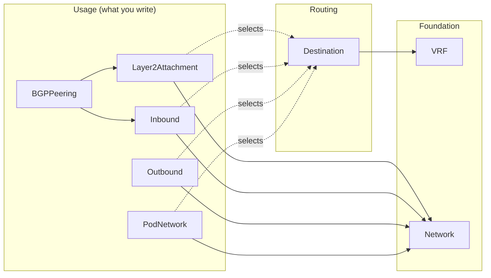

# Das Schiff Network Operator

`network-operator` configures and monitors the host router of every Kubernetes
node according to a declarative, intent-based specification. It is the control
plane for a **BGP-EVPN-to-the-host** network architecture: instead of manually
configuring FRR, VXLAN tunnels, VRFs, MetalLB pools and policy routes on each
node, you describe *what* connectivity a workload needs and the operator derives
and rolls out the per-node configuration for you.

## What it does

- **Attaches networks** to nodes as Layer 2 segments (VLAN sub-interfaces or
  HBN VXLAN) — see [Layer2Attachment](guides/layer2-attachment.md).
- **Allocates ingress LoadBalancer IPs** from a network and advertises them via
  BGP or L2 (MetalLB) — see [Inbound](guides/inbound.md).
- **Enables egress / SNAT** for pods via Coil / Calico pools — see
  [Outbound](guides/outbound.md).
- **Peers BGP** with L2 clients or tenant workloads (BGPaaS) — see
  [BGPPeering](guides/bgp-peering.md).
- **Provisions additional pod networks** for CNI integration — see
  [PodNetwork](guides/pod-network.md).
- **Mirrors traffic** to a GRE collector for inspection — see
  [Traffic Mirroring](guides/traffic-mirroring.md).

## How the pieces fit together

You compose a small set of Kubernetes custom resources. A **foundation layer**
(`VRF`, `Network`) defines the fabric identity and IP pools; a **routing layer**
(`Destination`) defines reachable prefixes; and a **usage layer** (`Inbound`,
`Outbound`, `Layer2Attachment`, `PodNetwork`, `BGPPeering`, traffic mirroring)
expresses what a workload actually needs. The operator resolves the references,
renders per-node `NodeNetworkConfig` / `NodeNetplanConfig`, and rolls them out
node by node.

## Where to start

- :material-book-open-variant: **[Concepts](getting-started/concepts.md)**

    Understand the intent model, the resource layers, and the vocabulary used
    throughout these docs.

- :material-rocket-launch: **[Quick Start](getting-started/quick-start.md)**

    A minimal end-to-end example: attach a network and expose an ingress
    LoadBalancer IP.

- :material-tools: **[Guides](guides/inbound.md)**

    Task-oriented, copy-pasteable walkthroughs for each user-facing resource.

- :material-file-document-outline: **[CRD Reference](reference/crd-reference.md)**

    Auto-generated field-by-field reference for every custom resource.

!!! note "API group"
    The user-facing custom resources live in the API group
    `network-connector.sylvaproject.org/v1alpha1`. The lower-level
    `network.t-caas.telekom.com/v1alpha1` resources the operator generates are
    covered in [Advanced → Legacy API](advanced/legacy-api.md) and
    [Debugging](advanced/debugging.md).
